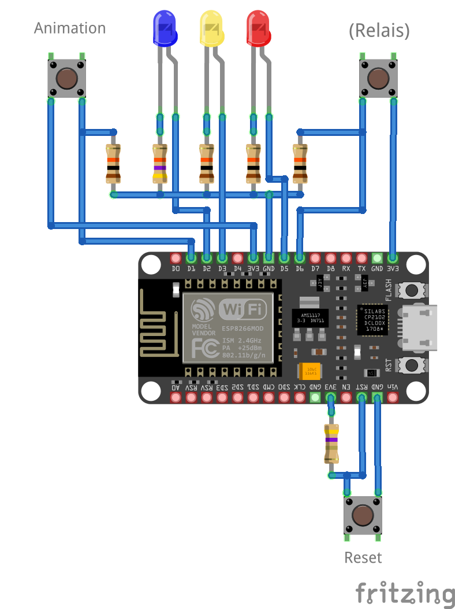

# hue-controller

## Idea
The idea is that as soon as an input is registered on the NodeMCU (caused by a motion sensor or whatever), it will tell the Philips Hue Bridge to turn on the lights in a specified group (room). To do so, it requires two scenes to be created in the Hue App which will be used to turn on the lights. Why? Because you can change color, brightness and beautiful color flows on power up without reflashing the NodeMCU, you can to that comftably in the Hue App! 

There are two modes available:

| With Animation | Without Animation |
|:---------------|:------------------|
|Using the `firstSceneTransitTime`, the first scene will be set. From there on, the light will slowly fade to the second scene with the `secondSceneTransitTime`|The NodeMCU will turn on the lamps by applying the second scene and the `defaultTransitTime`|

## Hardware
- NodeMCU Dev Kit with ESP8266
- 4x 10k Ohm Resistor
- 1x 47k Ohm Resistor
- 1x 4,7 Ohm Resistor
- 2x Push Button
- 3x colored 3mm LEDs
- 1x PCB

Hook everything up like this:

## Setup
1. Wire everything up as shown in the schematic
2. Create two new scenes in the Philips Hue App, one for the first and one for the second stage of power up
3. Clone this repo with `git clone https://github.com/fussel132/hue-controller.git`
4. In `hue-controller.ino`, you need to set a fev variables, they are marked with "Set before upload!" (See [here](https://developers.meethue.com/develop/get-started-2/) on how to get an API key)
5. I've written a small python script that can retrieve scene IDs and groupIDs. To use it, run it in your terminal with `python3 get-info.py` and enter your Bridge IP and API key when prompted
6. Upload the sketch to your NodeMCU Dev Kit
7. Enjoy!

## Operation/LED Patterns
|Action|Reaction|
|:-----|:-------|
|"Reset" button pressed|The NodeMCU will reboot and reconnect to the WiFi|
|"Animation" button pressed| Switch animation mode on or off. Current state indicated with the red LED, see below|
|"Relais" pin set high/input detected|The NodeMCU will turn on the lamps either with or without animation/fade|
|"Relais" pin set low again|The NodeMCU will turn off the light with `defaultTransitTime`|

|LED Pattern|Meaning|
|:----------|:------|
|Red LED on|Animation mode is off|
|Red LED off|Animation mode is on|
|Blue LED on|The NodeMCU is connected to the WiFi|
|Blue LED blinking|The NodeMCU is connecting to the WiFi|
|Yellow LED off|No motion/input detected|
|Yellow LED on|Motion/input detected|
|Yellow LED blinking|The NodeMCU currently talks to the Hue Bridge|

## Troubleshooting
No problems occured yet, let me know!

## Custom behaviour
- The pins for LEDs and buttons can be changed easily in the code
- If you want to change the default state of the animation functionality, change line 42 to `bool animation = false;`. Note that the red LED will light up constantly from there.
- The transition time (in ms) between states can be customized in line 32, 33 and 34
- You can enable a "serial mode" in line 37, this will allow you to turn the lights on and off by sending "ON" or "OFF" (instead of setting the Relais-Pin high) via the serial monitor (no line ending!)
- I've left some comments, feel free to edit the code so it fits your need

## Changelog
- v1.0.2: Initial release (10.01.2023)
- v1.1.0: See [Release Notes](https://github.com/fussel132/hue-controller/releases/v1.1.0) for details (15.01.2023)

## Licence
MIT License
